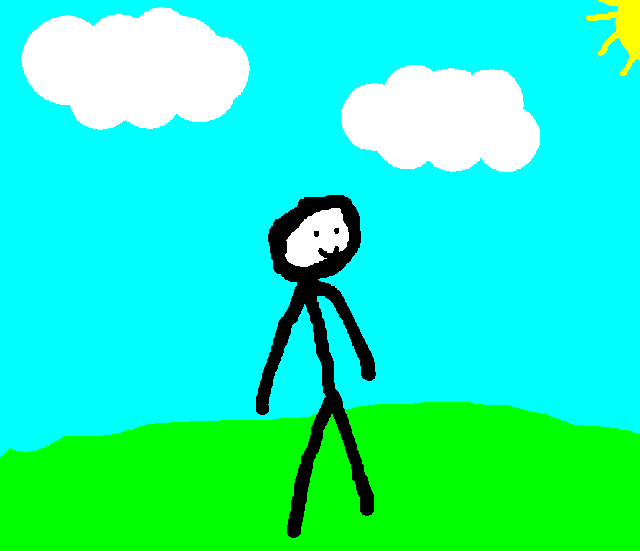

# AnimaShader
AnimaShader é um shader desenvolvido para criar animações a partir de imagens estáticas. O intuíto é tornar imagens simples em imagens mais animadas com um simples efeito de distorção que é ativado e desativado periodicamente. O intuito do AnimaShader é emular o efeito das imperfeições de animações desenhadas a mão.

Imagem original:

Imagem Resultado:

